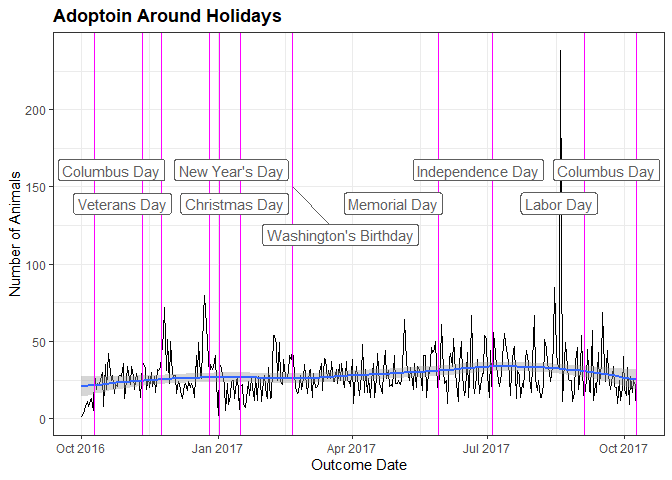

Dallas Animal Shelter
================
Alex Brown
November 15, 2018

-   [1 Project Overview](#1-project-overview)
-   [2 Data Description](#2-data-description)
-   [3 Data Manipulations](#3-data-manipulations)
-   [4 Analysis](#4-analysis)
    -   [4.1 Intake](#41-intake)
    -   [4.2 Time at Shelter](#42-time-at-shelter)
    -   [4.3 Outcome](#43-outcome)
-   [5 Conclusion](#5-conclusion)
-   [6 Plans for Further work:](#6-plans-for-further-work)

# 1 Project Overview

For this project, I have chose to look at a data set from an Animal
Shelter’s in Dallas, TX. Animal shelters help animals find new homes and
maintain a safe city. I believe this report can be used to help this
shelter save money and operate more efficiently. In addition, this data
set can be used in various ways such as marketing, keeping appropriate
inventory of pet supplies on hand, and staffing necessary resources at
certain times.

The Dallas Animal Shelter data set can be found on the
[TidyTuesday](https://github.com/rfordatascience/tidytuesday) project
website at the following link:
[week18_dallas_animals.xlsx](https://github.com/rfordatascience/tidytuesday/blob/master/data/2018-07-31/week18_dallas_animals.xlsx)

Each data point represents a different animal that entered the shelter
identified by an `andimal_id`. Each observation includes the type of
animal, the breed of the animal, the `intake_type`, the `outcome_type`,
and dates of these events. In addition, there is information about what
condition the animal was in at the time of intake and at the time of the
outcome.

The intentions with this data set is to answer a multitude of different
questions that could help the animal shelter in the future. I think the
following questions can help the animal shelter optimize a plan for
incoming pets and try to maximize the opportunity for a pet to get
adopted:

-   Is there any spikes for adoptions and intake? And can I link them to
    any reasons?
-   How long are animals typically at the shelter? How long for
    different outcomes?
-   Which dog breeds are most likely to be adopted?
-   Which dog breed is adopted the quickest?

# 2 Data Description

To read in this data, I have downloaded the file from the above link and
created a project to easily read in the file. This `R-Markdown` is part
of a package. If you unzip and open the package, you should be able to
run this code easily. One thing to note, the following packages were
used to create this report and you will need to `install.packages`
before running the code:

-   `readxl` - to read in excel files.
-   `scales` - for adjusting graphics legends and axes.
-   `lubridate` - fast and user friendly way to work with dates.
-   `rvest` - for scraping information off of the web.
-   `RColorBrewer` - for changing graph colors
-   `tidyverse` - a collection of packages to manipulate and graph data.

To get started, I will walk you through my analysis process. One thing I
noticed immediately with this data set was that there were two tabs on
the Excel sheet. The first tab was labeled `raw`, while the second was
labeled `simple`. To ensure I had all the data possible I did a quick
comparison of the two data sets by `left_joining` the `raw` tab’s column
names to the `simple` tab’s column names and making sure there was no
`NA` values. I then ensured the lengths of each tab were the same using
`nrow`.

    ##      colname_simple      colname_raw
    ## 1         animal_id        animal_id
    ## 2       animal_type      animal_type
    ## 3      animal_breed     animal_breed
    ## 4             month            month
    ## 5              year             year
    ## 6      census_tract     census_tract
    ## 7  council_district council_district
    ## 8       intake_type      intake_type
    ## 9       intake_date      intake_date
    ## 10     outcome_type     outcome_type
    ## 11     outcome_date     outcome_date
    ## 12      chip_status      chip_status
    ## 13    animal_origin    animal_origin

    ## [1] TRUE

This proved that the `simple` tab is just a subset of the `raw` tab.
Since the `raw` data is not overly large, I will just use the `raw` tab
and filter out columns that really won’t help. This way I will avoid
missing any conclusions that can be drawn from the `raw` tab information
that cannot be drawn from the `simple` tab. Below is a `glimpse` of the
Dallas Animal Shelter columns which seemed potentially meaningful form
the `raw` tab.

    ## Rows: 34,819
    ## Columns: 22
    ## $ animal_id              <chr> "A0979593", "A0743013", "A1004433", "A0969724",~
    ## $ animal_type            <chr> "DOG", "DOG", "BIRD", "DOG", "DOG", "DOG", "CAT~
    ## $ animal_breed           <chr> "RHOD RIDGEBACK", "YORKSHIRE TERR", "CHICKEN", ~
    ## $ kennel_number          <chr> "FREEZER", "RECEIVING", "BAY 31", "DC 15", "PSD~
    ## $ council_district       <chr> "2", "11", "3", "2", "4", "1", "1", "4", "6", "~
    ## $ intake_type            <chr> "CONFISCATED", "STRAY", "STRAY", "STRAY", "OWNE~
    ## $ intake_subtype         <chr> "QUARANTINE - DEAD ON ARRIVAL", "POSSIBLY OWNED~
    ## $ reason                 <chr> NA, NA, NA, NA, NA, NA, NA, NA, NA, NA, NA, "OT~
    ## $ staff_id               <chr> "AS", "HILLMON", "SC", "MMORALES", "SR/", "ARV"~
    ## $ intake_date            <dttm> 2017-02-20, 2016-11-19, 2017-08-07, 2016-12-15~
    ## $ intake_time            <dttm> NA, 1899-12-31 18:00:00, NA, 1899-12-31 14:00:~
    ## $ due_out                <dttm> 2017-02-20, 2016-11-29, 2017-08-11, 2016-12-19~
    ## $ intake_condition       <chr> "UNHEALTHY UNTREATABLE NON-CONTAGIOUS", "TREATA~
    ## $ hold_request           <chr> "RABIES SPECIMEN", NA, NA, NA, "EVERYDAY ADOPTI~
    ## $ outcome_type           <chr> "DEAD ON ARRIVAL", "RETURNED TO OWNER", "TRANSF~
    ## $ outcome_date           <dttm> 2017-02-21, 2016-11-19, 2017-08-08, 2016-12-20~
    ## $ outcome_time           <dttm> NA, NA, NA, 1899-12-31 09:00:00, 1899-12-31 22~
    ## $ outcome_condition      <chr> "UNHEALTHY UNTREATABLE NON-CONTAGIOUS", "TREATA~
    ## $ animal_origin          <chr> "FIELD", "FIELD", "FIELD", "FIELD", "OVER THE C~
    ## $ additional_information <chr> NA, NA, NA, "ADOPT PENDING SX 12-20-16", NA, NA~
    ## $ month                  <chr> "FEB", "NOV", "AUG", "DEC", "FEB", "OCT", "SEP"~
    ## $ year                   <dbl> 2017, 2016, 2017, 2016, 2017, 2016, 2017, 2017,~

# 3 Data Manipulations

Below is a list of manipulations done in order for better analysis of
the data:

-   I added `intake_day` and `outcome_day` which represents the day of
    the week when the intake or outcome happened, respectively. This
    will allow for insight to activity on different days of the week.
-   I added `total_time` which represents the number of days of the
    animal was at the shelter.
-   I lumped the 20% least common types of dog breeds brought into the
    Dallas Animal Shelter as `OTHER`. During the analysis of this
    report, I discovered there were many different types of dog breeds
    brought into the shelter and many instance where there was only one
    or two dogs of that particular dog breed type which was brought into
    the shelter. Lumping the least common dog breeds into one breed type
    `OTHER` allows for better visual analysis of dog breeds. To do this,
    I used the following steps:
    -   Counted dogs by breed type.
    -   Arranged the breeds in descending order by count.
    -   Added a column which gave the percent of total dogs.
    -   Added a column which gave a cumulative percent of that percent
        column
    -   Added a `new_breed` column which kept the original breed type of
        any animal under the 80% point of the cumulative percent column.

# 4 Analysis

The analsis is broken in down in three different “events”. Intake, Time
at Shelter, and Outcome. These sections represent the flow of an animal
coming into the shelter, the time at the shelter, and then leaving the
shelter.

## 4.1 Intake

There is **34,819** animals which the Dallas Animal Shelter has taken
in. As you can see from the `Intake Time Series` graph below, there is
about a years worth of data. The `Intake Time Series` graph also shows
that the data from the Dallas Animal Shelter could have some
seasonality. The smoothing line dips in the winter months and then
spikes in the spring and summer months. However, one years worth of data
is not really sufficient for identifying seasonality.

    ## `geom_smooth()` using formula 'y ~ x'

The next thing I will look at is why animals are being administered to
the Dallas Animal Shelter. The graph below shows different
`intake_types` ordered from most common `intake_type` to least common. I
can see that `Stray` and `Owner Surrender` are the highest on the list.
This is expected. While there are going to be a few lost dogs and a few
owners who surrender their dogs because of a conflict, most of them are
likely to be found on the street.

To look closer at these predominate intake types, I can take the column
I added earlier, `intake_day`, which gives the day of the week of the
`intake_date` and `filter` down to intake types equal to `STRAY` or
`OWNER SURRENDER`. I can then make a graph to see if there are days of
the week where an owner is more likely to surrender their pet or if it
is more likely someone will call in or catch a stray.

There are a couple things I can identify from the `Intake Type by Day`
graph. One is that intake’s are slow on Sundays. After reviewing the
[Dallas Animal
Shelter](https://dallascityhall.com/departments/dallas-animal-services/Pages/default.aspx)\*
hours online, the hours are shorter on Sunday. However, they are
reasonable considering not many people work on Sunday (assuming I am
looking at the right shelter). Another interesting, but unexplainable,
conclusion that can be drawn from this graph, is that there is a larger
number or strays found on Wednesdays.

\*Caution: the animals are really cute on the above link!

Lastly, and probably most obvious while analyzing intake, I will look at
what types of animals the Dallas Animal Shelter is taking in.

As expected, there are way more dogs than anything else. Because of the
large percentage of dogs relative to every other animal types, it will
be worth taking a closer look at dogs specifically. The below
`Count of Dog Breeds` graph represents the number of each type of dog
breed brought into the shelter.

From there I can create a graphic which tells me how the different types
of dog breeds came into the shelter. To focus our analysis, I will
`filter` down to the two most common intake types, `STRAY` and
`OWNER SURRENDER`. Also, to put everything on the same scale I used the
percent of dog breeds by `intake_type`. The graph below,
`Dog Breed by Intake Types`, has the potential to show us what types of
animals most commonly are surrendered by owner. Thankfully for humanity,
but unfortunately for this graph, there is a large percent of each dog
breed type that are brought in as strays. However, the
`Dog Breed by Intake Types` graph does pull out some insight to what dog
breeds that might be a little more difficult to deal with and are more
likely to be brought in by the owner.

    ## `summarise()` has grouped output by 'intake_type'. You can override using the
    ## `.groups` argument.

## 4.2 Time at Shelter

For this section, I will look at the time animals spend at the shelter.
An animal shelter obviously houses animals, but sadly, only has room for
so many animals. To understand how long animals are in the shelter, I
will use the variable I added in the beginning called `total_time` which
indicates how many days the animal was in the shelter by using
`datediff` on `intake_date` and `outcome_date`. I found that average
amount of time an animal spends at the Dallas Animal Shelter is 6.27
days and the time average amount of time that a dog is there before
being adopted is is 8.30 days. The table below shows average time at the
animal shelter for different `outcome_types`. I can see that if there is
an issue with a report, the animal will likely be there a longer time.
It is interesting that there are outcome types with reporting issues and
makes one wonder what actually physically happens to these animals.

    ##         outcome_type   avg_time
    ## 1        LOST REPORT 12.72 days
    ## 2       FOUND REPORT 12.38 days
    ## 3            MISSING 11.43 days
    ## 4           ADOPTION  8.33 days
    ## 5           TRANSFER  6.67 days
    ## 6             FOSTER  6.01 days
    ## 7         EUTHANIZED  4.59 days
    ## 8               DIED  3.82 days
    ## 9  RETURNED TO OWNER  2.75 days
    ## 10   DEAD ON ARRIVAL  1.48 days
    ## 11          WILDLIFE  0.56 days

Next, I looked at the two most interesting and important outcomes,
`ADOPTION` and `EUTHANIZED` in the
`Histogram of Time at Shelter by Top Outcomes` graph. As you can see,
the time spent at the Dallas Animal Shelter is usually not that long and
extremely right skewed. However, the graphs align with our previous
findings that animal spends about 6.27 at the shelter.

To bring the focus more to dogs again, the below
`Average Time at Shelter Before Adoption` graph represents the average
number of days that a particular dog breed spends at the Dallas Animal
Shelter before it is adopted. While this animal shelter’s data set does
not have “animal size”, but from basic knowledge of dog size, I can see
that smaller dogs are adopted more quickly.

To further investigate this, I created an `adoption_ratio` for the
`breed_type` which took the number of that breed that the shelter took
in altogether and compared to those that were adopted of that breed. I
then filter down to the top ten breed types and plotted the adoption
ratio on the x-axis and number the number of days on the y axis to
create the `Adoption Ratio by Adoption Days` graph below. I expected to
see as the ratio went up, the amount of time it took to adopt the animal
to go down. However, that doesn’t appear to be the case. The amount of
time before a dog gets adopted, again, apears to be more related to the
size of dog than the likelyhood that it will be adopted.

## 4.3 Outcome

Next I will do the same type of time series analysis on the
`outcome_date` as I did on the `income_date`. The `Outcome Time Series`
graph below shows the same seasonality as our intake data, the smoothing
line dips in the winter months and then spikes in the spring and summer
months. While it is not as drastic of a sign for seasonality, this is
not surprising since when it is warm out I want to be outside and walk
with dogs, while some people could look at an animal being a burden in
the winter time.

    ## `geom_smooth()` using formula 'y ~ x'

Similar to our `Intake Time Series` graph, the `Outcome Time Series`
graph has large spikes from day to day. I wanted to see if there was any
effects of holidays on adoption. To do this, I used a federal holiday
data set from
[Kaggle](https://www.kaggle.com/gsnehaa21/federal-holidays-usa-19662020)
and plotted them as vertical lines on our time series graph. From the
below graph, `Adoption Around Holidays`, I can see that there are large
spikes right after Thanksgiving and right before Christmas. This is
expected after Thanksgiving because adoption centers usually have some
sort of black Friday promotion and a puppy is obviously the perfect
Christmas gift. I know I want one!

The other big spike before Labor Day is somewhat unexplained. My guess
is that they had some sort of big promotion. I am pretty sure the humane
society in my town does a promotion for free or $1 dogs at some point in
the summer.

    ## `geom_smooth()` using formula 'y ~ x'

    ## Warning: ggrepel: 2 unlabeled data points (too many overlaps). Consider
    ## increasing max.overlaps

Moving on, the `Outcome Types` graph below represents the
`outcome_types` of animals from the Dallas Animal Shelter ordered from
most common `outcome_types` to least common. I can see that `ADOPTION`,
`EUTHENIZED`, and `TRANSFER` are the most common. `ADOPTION` and
`EUTHENIZED` are expected to be the most common because that is the
purpose of an animal shelter.

Like I did in our `Dog Breed Intake Types` graph, I looked at percent of
dog breeds by `outcome_type`. The `Dog Breed by Outcome Types` graph
gives us insight to what types of animals most commonly are adopted or
euthanized. As you can see, there are dog breeds which are more likely
to be put down. These dogs are the breeds which someone would stereotype
with being aggressive. For example, it is about a 50/50 chance that
Pitbull’s and Rottweiler’s will be adopted or euthanized, so it is
possible those stereo types are true. However, Pitbulls are the most
common animal brought into the shelter so there is a bigger sample and
it is possible they have a lesser standard for why they would
euthanized.

    ## `summarise()` has grouped output by 'outcome_type'. You can override using the
    ## `.groups` argument.

To plan accordingly, it will be a good idea to look at the adoption rate
on a daily basis. As you can see from the below `Adoption by Day` graph,
Saturdays are the busiest days, which is not surprising. Another useful
insight which can be seen from this graph is that the beginning of the
work week is relatively busy compared to the end of the work week. With
this information, the humane society can staff appropriately to speed up
the process of customers adopting dogs and possibly increase the number
of adoptionn as customers won’t be waiting around deciding whether or
not to adopt a dog.

# 5 Conclusion

In conclusion, besides wanting to adopt a dog, I believe that the
information provided, will be abe to help animal shelters better
understand their data in multiple ways to save them time, money, and
resources. I found that the Dallas Animal Shelter could have some
seasonality in both their intake of dogs and outcome of dogs. I know
that the most common intake type for the Dallas Animal Shelter is a
stray and that strays are usually found on Wednesday’s and most likely,
a Pitbull. I found that there may be some dogs which are a little more
difficult to deal with than other dogs due to the percent of owner
surrenders, but there is no particular dog types which stick out as
being extreamly difficult to deal with.

In our analysis when I examined how long animals are at the Dallas
Animal Shelter I found that average amount of time an animal spends at
the Dallas Animal Shelter is 6.27 days and the time average amount of
time that a dog is there before being adopted is is 8.30 days and varys
between dog breeds. Overally, I can see that animals are usually adopted
withing a week or so, but even shorter amont of time if they are a small
dog breed. In addtion to findings about adoption, I found that the
Dallas Animal Shelter could possibly have a process or reporting problem
which holds dogs up from being adopted.

When looking at the outcome of animals and dogs from the Dallas Animal
shelter, I took a closer look at adoption through out the year and tied
dates of adoption to holiday’s. I found the dallas animal shelter can
expect a lot more adoptions right after Thanksgiving and right before
Christmas. I know that animals at the Dallas anmial shelter are likely
going to be adopted, euthanized, or transfered and that more agressive
dog breeds have a higher probability of being euthanized. In addtion, I
know what the beginning of the week and Saturdays are usaully busier at
the Dallas Animal Shelter.

# 6 Plans for Further work:

To improve this study, I could look at things such as:

-   Review promotions that the Dallas Animal Shelter has by scraping
    their facebook or twitter.
-   Include how dog size relates to adoption by finding a data set with
    dog size and then cleaninng and standarizing the dog names and
    joining to our data set.
-   When I `glimpsed` at the data you could see there were kennel
    numbers. If I had enough data I could see if location of animals and
    adoption rates are related.
-   I could break down adoption by month to see if there is busier
    months than others, or even times to see if the selter is busier at
    certain times to staff apporpiately.
