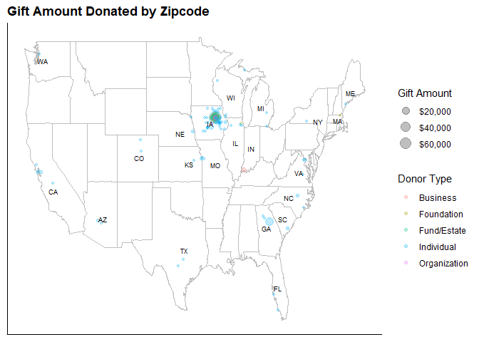

## Overview

The objective of this project was to provide a report about donation information to try and improve the knowledge of the donor base the Grout Museum has. This will allow the Grout Museum to better target that type of donor and potentially increase donations. This report will look at outliers, trends, donor types, and geographical information. Finally, this report will provide a brief summary and any recommendations based on the analysis along with potentials for any future studies.


## Software Used in Analysis

For the the donation analysis and report, R was used. R allowed for easy manipulation of data, easy implementation of map data and implementing the analysis into a report.


## The Data

The data provided was information about the donations that were received. This information includes the date of the donation, the type of donor, the donation amount, and the zipcode.
A `glimpse` of the data can be seen below:


```
## Observations: 554
## Variables: 4
## $ date        <dttm> 2018-01-31, 2017-12-20, 2018-02-23, 2017-07-05, 2018-0...
## $ donor_type  <chr> "Business", "Individual", "Business", "Foundation", "In...
## $ gift_amount <dbl> 50.00, 100.00, 500.00, 22.40, 50.00, 5100.00, 500.00, 2...
## $ zip         <chr> "50643", "50677", "50704", "01810", "50701", "50701", "...
```

In addition, R data sets for map information were also pulled in. These sets included zip-code information, which provided a latitude and longitude of each zip-code, and a data set which provided the latitude and longitude of the center of each state for labeling purposes.

## Time Series Analysis

As you can see from the `Number of Donors Over Time` graph below, there is about a years worth of data. The `Number of Donors Over Time` graph also shows that the donation data from the Grout Museum could have some seasonality. The smoothing line spikes in the winter months and then increase somewhat again in the summer months. However, one years worth of data is not really sufficient for identifying seasonality.

<!-- -->

## Outlier Analysis

After many instance of trying to portray the detail of the data, and extracting useful information, I found it beneficial to look at individual donors and then weed out outliers. You can see from the `Count of Individual Donor` graph that there are a few outliers who donated more that `$10,000` to the Grout Museum. This greatly skews the data and makes it hard to see any trends. By reducing the information to individuals who donated less that `$1,000` to the Grout Museum, we can see in the `Count of Individual Donors <= $1,000` that most people are donating around 25-100 dollars. Knowing this can potentially increase focus on getting donations of that amount. On the other hand, it could just point out the strategies already being used by the Grout Museum.

<!-- -->

## Donors by Group

The table below shows the number of each donors by type, the average gift each donor type is providing, and the the mode of what each donor type is providing. This further emphasizes the importance of looking at outliers. The mean of the individual donors is much more than the mode. The table below will also give The Grout Museum a better understanding of price points they can give to different donor types.


<table class="table table-hover table-condensed" style="margin-left: auto; margin-right: auto;">
<caption>Count/Mean/Median of Donations by Donor Type</caption>
 <thead>
  <tr>
   <th style="text-align:left;"> donor_type </th>
   <th style="text-align:right;"> count </th>
   <th style="text-align:left;"> gift_mean </th>
   <th style="text-align:left;"> gift_mode </th>
  </tr>
 </thead>
<tbody>
  <tr>
   <td style="text-align:left;"> Business </td>
   <td style="text-align:right;"> 47 </td>
   <td style="text-align:left;"> $588.62 </td>
   <td style="text-align:left;"> $330 </td>
  </tr>
  <tr>
   <td style="text-align:left;"> Foundation </td>
   <td style="text-align:right;"> 9 </td>
   <td style="text-align:left;"> $10,291.39 </td>
   <td style="text-align:left;"> $10,000 </td>
  </tr>
  <tr>
   <td style="text-align:left;"> Fund/Estate </td>
   <td style="text-align:right;"> 6 </td>
   <td style="text-align:left;"> $5,249.92 </td>
   <td style="text-align:left;"> $3,168.30 </td>
  </tr>
  <tr>
   <td style="text-align:left;"> Individual </td>
   <td style="text-align:right;"> 485 </td>
   <td style="text-align:left;"> $310.92 </td>
   <td style="text-align:left;"> $53 </td>
  </tr>
  <tr>
   <td style="text-align:left;"> Organization </td>
   <td style="text-align:right;"> 7 </td>
   <td style="text-align:left;"> $874.42 </td>
   <td style="text-align:left;"> $200 </td>
  </tr>
</tbody>
</table>

## Donors by Quarter

To look at times of year when the Grout Museum has more donations, I have broken out the donation amount by quarter. The `Donor Amount by Type and Quarter` graph below can show different times of year when you receive more donations. You can see that individuals donate fairly steady in quarters one, three, and four with a spike in winter months. This graph also shows there are less individuals donating in quarter two. This could potentially point out weak spots where the Grout Museum could target trying to increase their donation in order for a more steady donation stream over the year.

<!-- -->

However, as the graph below shows, the decrease in individual donations is actually supplemented by foundation donations and the low point of year for donations is actually the first quarter.

<!-- -->

## Zip-code Analysis - Count

The graph below shows the count of donors by zipcode. A bigger dot, means more people in that zipcode and the different donor types are represented by color. Only states with a label are where The Grout Museum is receiving donations from.

As expected, most donors the Grout Museum has are around the Cedar Valley area. However, there seem to be some sporadic donors around the country especially in the south east. This could be due to the nature of the museum being a war museum and a larger concentration of navel veterans or descendants of civil war veterans living in the south east region of the US.

<!-- -->

## Zip-code Analysis - Gift

Below is the same representation except the size of the dots now represent dollar amount.

<!-- -->

## Recommendations

My recommendation to the Grout Museum are to:

1. Strategize a way to collect entice individual donors to make $50 donations or more if you are not already doing so.
2. Strategize increase donations of individuals in 2nd quarter and all donations in 1st quarter.
3. Investigate the reason for donations from the south South East.

## Further Studies

To further look into the donations at the Grout Museum there are a few things that could be beneficial. One beneficial study would be investigating the outcomes of strategies used for collecting donations. For example, if you looked at the amount of people called or emailed with a different scripts or price points and the number, percent, and/or amount of donations you get from those strategies, you could figure out the best method.

While this report only looked at donation data, it would be great to also look at membership and customers data. One analysis that could be done with the addition of membership and customer data is to looking for trends in customers and memberships is associated with trends in donations. To do this, a longer time frame would need to be looked at with customer and membership data.
